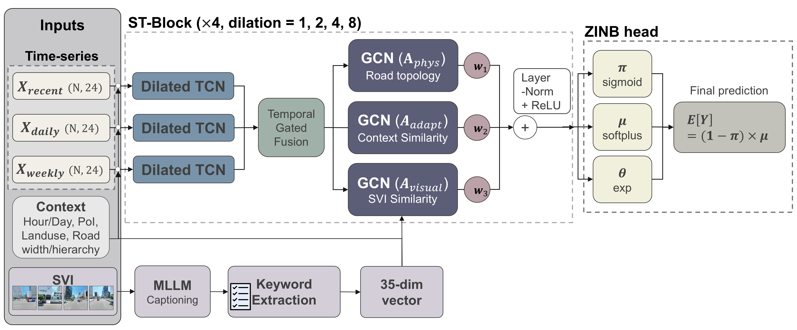
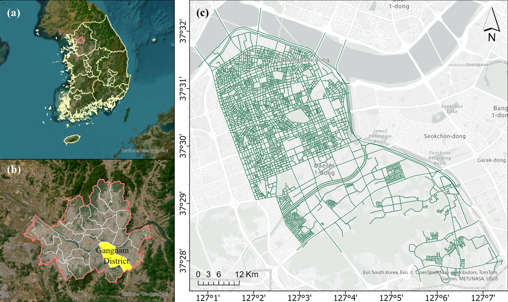

# MCAST-ZINB

**거리영상(Street View Imagery) 시각 정보를 활용한 불법주정차 발생 예측 모델**

도로 구간별·시간대별 불법주정차 발생 건수를 예측하는 시공간 그래프 신경망입니다. 행정 데이터만으로는 담기 어려운 **도로의 실제 시각 환경**(황색 실선, 볼라드, 보도 분리, 노상주차 등)을 멀티모달 LLM으로 해석해 예측에 결합한 것이 핵심입니다.

<p align="center">
  
</p>

> ACM SIGSPATIAL Workshop 제출 · 심사 중 (2026)  <!-- 학회/연도 정확한 명칭으로 수정하세요 -->

---

## 이 프로젝트는 무엇을 하나요?

서울 강남구의 도로 네트워크를 대상으로, **어느 도로에서 몇 시에 불법주정차가 몇 건 발생할지**를 예측합니다. 불법주정차는 상업지구의 영업시간, 학교 앞 등하교 시간, 저녁의 주거지 이면도로처럼 시공간적으로 뚜렷한 패턴을 보입니다. 이 규칙성을 학습하면 한정된 단속 인력을 더 효율적으로 배치할 수 있습니다.

기존 연구가 도로 형상·용도지역·POI·과거 위반 기록 같은 **행정 변수**에 의존한 반면, 이 프로젝트는 운전자가 실제로 보고 판단하는 **거리 수준의 시각 환경**을 예측에 도입합니다. 강남구 도로 5,661개 구간·불법주정차 512,580건을 대상으로 실험했으며, 상위 20% 위험 구간 포착률(HR@20%) 0.7244를 달성했습니다.

<p align="center">
  
  <br><em>연구 대상지 — 서울 강남구 도로 네트워크</em>
</p>

## 무엇이 새로운가요?

- **거리영상 시각 의미를 불법주정차 예측에 처음 통합** — 거리영상 캡션을 그대로 임베딩하는 대신, 멀티모달 LLM으로 도로 환경을 구조화 서술하고 불법주정차와 관련된 **35개 도메인 키워드**로 변환합니다. 각 차원이 해석 가능해, "어떤 시각 요소가 위반과 연관되는지"를 직접 확인할 수 있습니다.
- **3중 그래프 시공간 아키텍처** — 도로의 물리적 연결(phys), 행정 맥락 유사도(adapt), **시각 환경 유사도(visual)** 세 그래프를 학습 가능한 가중합으로 결합해, 인접 구간뿐 아니라 시각·기능적으로 닮은 구간끼리도 정보를 공유합니다.
- **희소 데이터에 맞춘 예측 헤드** — 대부분의 시점·구간이 0인 극도로 희소한 데이터를 다루기 위해 ZINB(Zero-Inflated Negative Binomial) 출력을 사용해 고위험 구간을 안정적으로 탐지합니다.

## 시작하기

이 프로젝트는 **Google Colab**(GPU + Google Drive) 환경에서 개발되었습니다.

1. 저장소를 클론하거나 Colab에서 엽니다.
2. `notebooks/MCAST_ZINB.ipynb`를 실행합니다.
3. **SECTION 0**에서 데이터 경로(`DRIVE_BASE`)와 API 키를 본인 환경에 맞게 수정합니다.
   (거리영상 캡션·키워드 추출에는 Google AI Studio API 키가 필요합니다.)
4. **SECTION 0~6**의 정의 셀을 모두 실행한 뒤, **SECTION 7**에서 전처리 → 학습 → 평가 순으로 실행합니다.

> ⚠️ **원 데이터는 저장소에 포함되어 있지 않습니다** (용량·라이선스). 서울 열린데이터광장, 국가공간정보포털 등 원 출처에서 직접 내려받아야 합니다. 따라서 저장소만으로는 end-to-end 실행이 되지 않으며, 구조와 방법론 확인 용도로 열람하실 수 있습니다.

## 저장소 구성

```
mcast-zinb/
├── notebooks/MCAST_ZINB.ipynb              # 전체 파이프라인 (전처리 → 거리영상 → 그래프 → 학습 → 평가)
├── src/
│   ├── ablation_multistep.py               # Ablation study 실행 모듈
│   └── baseline_models_multistep.py        # 비교 baseline (HA/LSTM/GRU/STGCN/DCRNN/GraphWaveNet/ASTGCN)
├── docs/model_architecture.png             # 모델 구조도
└── requirements.txt
```

## 도움 · 문의

버그나 질문은 이 저장소의 **Issues** 탭에 남겨 주세요.
연락처: tjgus_54@ewha.ac.kr / http://github.com/tjgus54-ux  <!-- 채워 넣으세요 -->

## 제작자

**윤서현** · 이화여자대학교 / 일반대학원 사회과교육학과 지리학전공
tjgus_54@ewha.ac.kr · http://github.com/tjgus54-ux

---

© 2026 Seohyeon Yoon. All rights reserved.
이 저장소의 코드는 열람 목적으로 공개되며, 별도 허가 없이 복제·재배포·수정·상업적 이용을 허용하지 않습니다.
